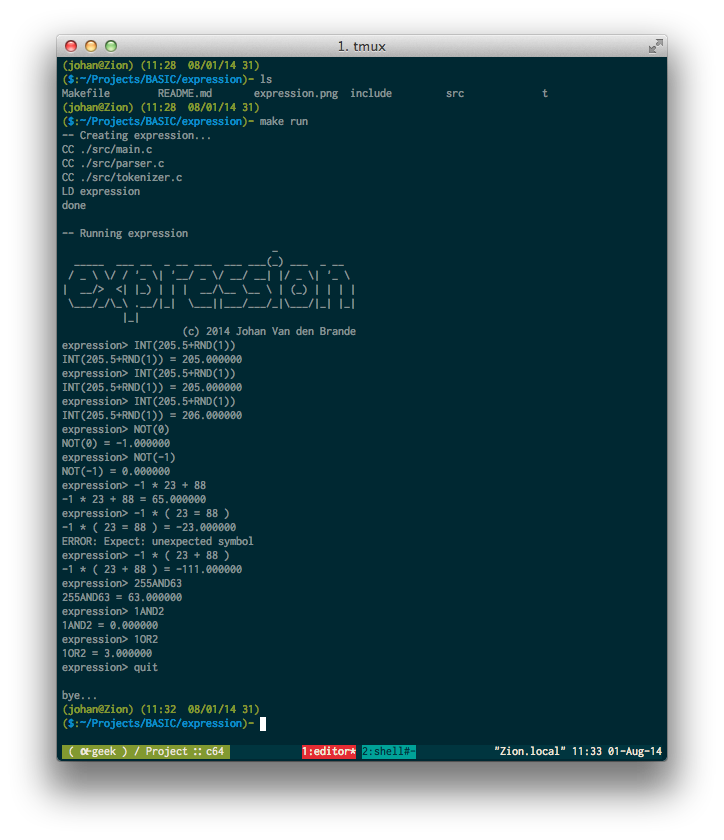

                                       _             
      _____  ___ __  _ __ ___  ___ ___(_) ___  _ __  
     / _ \ \/ / '_ \| '__/ _ \/ __/ __| |/ _ \| '_ \ 
    |  __/>  <| |_) | | |  __/\__ \__ \ | (_) | | | |
     \___/_/\_\ .__/|_|  \___||___/___/_|\___/|_| |_|
              |_|                                    
    

# Expression

A simple command line calculator that uses a recursive descent parser, written in C.

Made as an exercise in tokenizing and parsing...

## Supported features

Below is the BNF of the parser. The functions are named and behave the same as those found in C64 BASIC.

      expression = ["+"|"-"] term {("+"|"-"|"OR") term} .
    
      term = factor {( "*" | "/" | "AND" ) factor} .
    
      factor = 
        func "(" expression ")" 
        | number
        | "(" expression ")" .
    
      func =
        ABS
        | AND
        | ATN
        | COS
        | EXP
        | INT
        | LOG
        | NOT
        | OR
        | RND
        | SGN
        | SIN
        | SQR
        | TAN

## Compulsory screenshot

